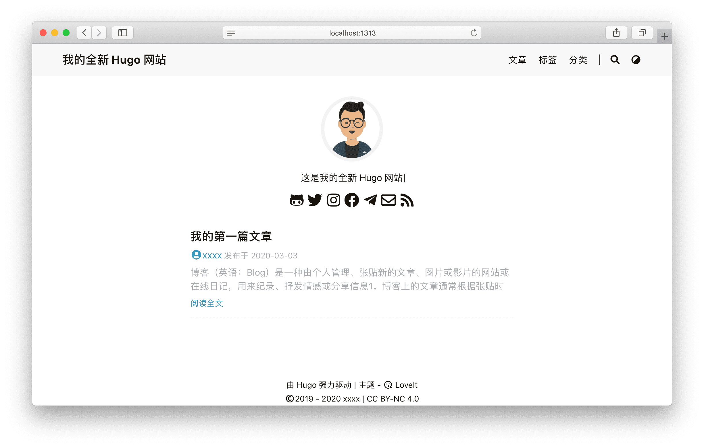

探索 Hugo - **LoveIt** 主题的全部内容和背后的核心概念.

<!--more-->

## 1 准备

由于 Hugo 提供的便利性, [Hugo](https://gohugo.io/) 本身是这个主题唯一的依赖.

直接安装满足你操作系统 (**Windows**, **Linux**, **macOS**) 的最新版本 [:(far fa-file-archive fa-fw): Hugo (> 0.62.0)](https://gohugo.io/getting-started/installing/).


由于 [Markdown 渲染钩子函数](https://gohugo.io/getting-started/configuration-markup#markdown-render-hooks) 在 [Hugo 圣诞节版本](https://gohugo.io/news/0.62.0-relnotes/) 中被引入, 本主题只支持高于 **0.62.0** 的 Hugo 版本.



由于这个主题的一些特性需要将 :(fab fa-sass fa-fw): SCSS 转换为 :(fab fa-css3 fa-fw): CSS, 推荐使用 Hugo **extended** 版本来获得更好的使用体验.


## 2 安装

以下步骤可帮助你初始化新网站. 如果你根本不了解 Hugo, 我们强烈建议你按照此 [快速入门文档](https://gohugo.io/getting-started/quick-start/) 进一步了解它.

### 2.1 创建你的项目

Hugo 提供了一个 `new` 命令来创建一个新的网站:

```bash
hugo new site my_website
cd my_website
```

### 2.2 安装主题

**LoveIt** 主题的仓库是: [https://github.com/dillonzq/LoveIt](https://github.com/dillonzq/LoveIt).

你可以下载主题的 [最新版本 :(far fa-file-archive fa-fw): .zip 文件](https://github.com/dillonzq/LoveIt/releases) 并且解压放到 `themes` 目录.

另外, 也可以直接把这个主题克隆到 `themes` 目录:

```bash
git clone https://github.com/dillonzq/LoveIt.git themes/LoveIt
```

或者, 初始化你的项目目录为 git 仓库, 并且把主题仓库作为你的网站目录的子模块:

```bash
git init
git submodule add https://github.com/dillonzq/LoveIt.git themes/LoveIt
```

### 2.3 基础配置 {#basic-configuration}

以下是 LoveIt 主题的基本配置:

```toml
baseURL = "http://example.org/"
# [en, zh-cn, fr, ...] 设置默认的语言
defaultContentLanguage = "zh-cn"
# 网站语言, 仅在这里 CN 大写
languageCode = "zh-CN"
# 是否包括中日韩文字
hasCJKLanguage = true
# 网站标题
title = "我的全新 Hugo 网站"

# 更改使用 Hugo 构建网站时使用的默认主题
theme = "LoveIt"

[params]
  # LoveIt 主题版本
  version = "0.2.X"

[menu]
  [[menu.main]]
    identifier = "posts"
    # 你可以在名称 (允许 HTML 格式) 之前添加其他信息, 例如图标
    pre = ""
    # 你可以在名称 (允许 HTML 格式) 之后添加其他信息, 例如图标
    post = ""
    name = "文章"
    url = "/posts/"
    # 当你将鼠标悬停在此菜单链接上时, 将显示的标题
    title = ""
    weight = 1
  [[menu.main]]
    identifier = "tags"
    pre = ""
    post = ""
    name = "标签"
    url = "/tags/"
    title = ""
    weight = 2
  [[menu.main]]
    identifier = "categories"
    pre = ""
    post = ""
    name = "分类"
    url = "/categories/"
    title = ""
    weight = 3

true
# 作者配置
[author]
  name = "xxxx"
  email = ""
  link = ""

# 网站地图配置
[sitemap]
  changefreq = "weekly"
  filename = "sitemap.xml"
  priority = 0.5

# 
[Permalinks]
  # posts = ":year/:month/:filename"
  posts = ":filename"

# 
[privacy]
  #  Google Analytics 相关隐私 (被 params.analytics.google 替代)
  [privacy.googleAnalytics]
    # ...
  [privacy.twitter]
    enableDNT = true
  [privacy.youtube]
    privacyEnhanced = true

# 用于输出 Markdown 格式文档的设置
[mediaTypes]
  [mediaTypes."text/plain"]
    suffixes = ["md"]

# 用于输出 Markdown 格式文档的设置
[outputFormats.MarkDown]
  mediaType = "text/plain"
  isPlainText = true
  isHTML = false

# 用于 Hugo 输出文档的设置
[outputs]
  # 
  home = ["HTML", "RSS", "JSON"]
  page = ["HTML", "MarkDown"]
  section = ["HTML", "RSS"]
  taxonomy = ["HTML", "RSS"]
  taxonomyTerm = ["HTML"]
```


请注意, 本文档其他部分将详细解释其中一些参数.



`hugo serve` 的默认运行环境是 `development`,
而 `hugo` 的默认运行环境是 `production`.

由于本地 `development` 环境的限制,
**评论系统**, **CDN** 和 **fingerprint** 不会在 `development` 环境下启用.

你可以使用 `hugo serve -e production` 命令来开启这些特性.





```toml
[params.cdn]
  # CDN 数据文件名称, 默认不启用
  # ("jsdelivr.yml")
  data = ""
````

默认的 CDN 数据文件位于 `themes/LoveIt/assets/data/cdn/` 目录.
可以在你的项目下相同路径存放你自己的数据文件: `assets/data/cdn/`.





你可以直接配置你的社交 ID 来生成一个默认社交链接和图标:

```toml
[params.social]
  Mastodon = "@xxxx"
```

生成的社交链接是 `https://mastodon.technology/@xxxx`.

或者你可以通过一个字典来设置更多的选项:

```toml
[params.social]
  [params.social.Mastodon]
    # 排列图标时的权重 (权重越大, 图标的位置越靠后)
    weight = 0
    # 你的社交 ID
    id = "@xxxx"
    # 你的社交链接的前缀
    prefix = "https://mastodon.social/"
    # 当鼠标停留在图标上时的提示内容
    title = "Mastodon"
```

所有支持的社交链接的默认数据位于 `themes/LoveIt/assets/data/social.yaml`.
你可以参考它来配置你的社交链接.




### 3.2 网站图标, 浏览器配置, 网站清单

强烈建议你把:

* apple-touch-icon.png (180x180)
* favicon-32x32.png (32x32)
* favicon-16x16.png (16x16)
* mstile-150x150.png (150x150)
* android-chrome-192x192.png (192x192)
* android-chrome-512x512.png (512x512)

放在 `/static` 目录. 利用 [https://realfavicongenerator.net/](https://realfavicongenerator.net/) 可以很容易地生成这些文件.

可以自定义 `browserconfig.xml` 和 `site.webmanifest` 文件来设置 theme-color 和 background-color.

### 3.3 自定义样式




Hugo **extended** 版本对于自定义样式是必需的.


通过定义自定义 `.scss` 样式文件, **LoveIt** 主题支持可配置的样式.

包含自定义 `.scss` 样式文件的目录相对于 **你的项目根目录** 的路径为 `assets/css`.

在 `assets/css/_override.scss` 中, 你可以覆盖 `themes/LoveIt/assets/css/_variables.scss` 中的变量以自定义样式.

这是一个例子:

```scss
@import url('https://fonts.googleapis.com/css?family=Fira+Mono:400,700&display=swap&subset=latin-ext');
$code-font-family: Fira Mono, Source Code Pro, Menlo, Consolas, Monaco, monospace;
```

在 `assets/css/_custom.scss` 中, 你可以添加一些 CSS 样式代码以自定义样式.

## 4 多语言和 i18n

**LoveIt** 主题完全兼容 Hugo 的多语言模式, 并且支持在网页上切换语言.


### 4.1 兼容性 {#language-compatibility}



| 语言 | Hugo 代码 | HTML `lang` 属性 | 主题文档 | Lunr.js 支持 |
|:---- |:----:|:----:|:----:|:----:|
| 英语 | `en` | `en` | :(far fa-check-square fa-fw): | :(far fa-check-square fa-fw): |
| 简体中文 | `zh-cn` | `zh-CN` | :(far fa-check-square fa-fw): | :(far fa-check-square fa-fw): |
| 法语 | `fr` | `fr` | :(far fa-square fa-fw): | :(far fa-check-square fa-fw): |
| 波兰语 | `pl` | `pl` | :(far fa-square fa-fw): | :(far fa-square fa-fw): |
| 巴西葡萄牙语 | `pt-br` | `pt-BR` | :(far fa-square fa-fw): | :(far fa-check-square fa-fw): |
| 意大利语 | `it` | `it` | :(far fa-square fa-fw): | :(far fa-check-square fa-fw): |
| 西班牙语 | `es` | `es` | :(far fa-square fa-fw): | :(far fa-check-square fa-fw): |
| 德语 | `de` | `de` | :(far fa-square fa-fw): | :(far fa-check-square fa-fw): |
| 塞尔维亚语 | `pl` | `pl` | :(far fa-square fa-fw): | :(far fa-square fa-fw): |
| 俄语 | `ru` | `ru` | :(far fa-square fa-fw): | :(far fa-check-square fa-fw): |
| 罗马尼亚语 | `ro` | `ro` | :(far fa-square fa-fw): | :(far fa-check-square fa-fw): |
| 越南语 | `vi` | `vi` | :(far fa-square fa-fw): | :(far fa-check-square fa-fw): |

### 4.2 基本配置

学习了 [Hugo如何处理多语言网站](https://gohugo.io/content-management/multilingual) 之后, 请在 [站点配置](#site-configuration) 中定义你的网站语言.

例如, 一个支持英语, 中文和法语的网站配置:

```toml
# [en, zh-cn, fr, pl, ...] 设置默认的语言
defaultContentLanguage = "zh-cn"

[languages]
  [languages.en]
    weight = 1
    title = "My New Hugo Site"
    languageCode = "en"
    languageName = "English"
    [[languages.en.menu.main]]
      identifier = "posts"
      pre = ""
      post = ""
      name = "Posts"
      url = "/posts/"
      title = ""
      weight = 1
    [[languages.en.menu.main]]
      identifier = "tags"
      pre = ""
      post = ""
      name = "Tags"
      url = "/tags/"
      title = ""
      weight = 2
    [[languages.en.menu.main]]
      identifier = "categories"
      pre = ""
      post = ""
      name = "Categories"
      url = "/categories/"
      title = ""
      weight = 3

  [languages.zh-cn]
    weight = 2
    title = "我的全新 Hugo 网站"
    # 网站语言, 仅在这里 CN 大写
    languageCode = "zh-CN"
    languageName = "简体中文"
    # 是否包括中日韩文字
    hasCJKLanguage = true
    [[languages.zh-cn.menu.main]]
      identifier = "posts"
      pre = ""
      post = ""
      name = "文章"
      url = "/posts/"
      title = ""
      weight = 1
    [[languages.zh-cn.menu.main]]
      identifier = "tags"
      pre = ""
      post = ""
      name = "标签"
      url = "/tags/"
      title = ""
      weight = 2
    [[languages.zh-cn.menu.main]]
      identifier = "categories"
      pre = ""
      post = ""
      name = "分类"
      url = "/categories/"
      title = ""
      weight = 3

  [languages.fr]
    weight = 3
    title = "Mon nouveau site Hugo"
    languageCode = "fr"
    languageName = "Français"
    [[languages.fr.menu.main]]
      identifier = "posts"
      pre = ""
      post = ""
      name = "Postes"
      url = "/posts/"
      title = ""
      weight = 1
    [[languages.fr.menu.main]]
      identifier = "tags"
      pre = ""
      post = ""
      name = "Balises"
      url = "/tags/"
      title = ""
      weight = 2
    [[languages.fr.menu.main]]
      identifier = "categories"
      pre = ""
      post = ""
      name = "Catégories"
      url = "/categories/"
      title = ""
      weight = 3
```

然后, 对于每个新页面, 将语言代码附加到文件名中.

单个文件 `my-page.md` 需要分为三个文件:

* 英语: `my-page.en.md`
* 中文: `my-page.zh-cn.md`
* 法语: `my-page.fr.md`


请注意, 菜单中仅显示翻译的页面. 它不会替换为默认语言内容.



也可以使用 [文章前置参数](https://gohugo.io/content-management/multilingual#translate-your-content) 来翻译网址.


### 4.3 修改默认的翻译字符串

翻译字符串用于在主题中使用的常见默认值.
目前提供[一些语言](#language-compatibility)的翻译, 但你可能自定义其他语言或覆盖默认值.

要覆盖默认值, 请在你项目的 i18n 目录 `i18n/<languageCode>.toml` 中创建一个新文件，并从 `themes/LoveIt/i18n/en.toml` 中获得提示.

另外, 由于你的翻译可能会帮助到其他人, 请花点时间通过 [:(fas fa-code-branch fa-fw): 创建一个 PR](https://github.com/dillonzq/LoveIt/pulls) 来贡献主题翻译, 谢谢!

## 5 搜索



基于 [Lunr.js](https://lunrjs.com/) 或 [algolia](https://www.algolia.com/), **LoveIt** 主题支持搜索功能.

### 5.1 输出配置

为了生成搜索功能所需要的 `index.json`, 请在你的 [网站配置](#site-configuration) 中添加 `JSON` 输出文件类型到 `outputs` 部分的 `home` 字段中.

```toml
[outputs]
  home = ["HTML", "RSS", "JSON"]
```

### 5.2 搜索配置

基于 Hugo 生成的 `index.json` 文件, 你可以激活搜索功能.

这是你的 [网站配置](#site-configuration) 中的搜索部分:

```toml
[params.search]
  enable = true
  # 搜索引擎的类型 ("lunr", "algolia")
  type = "lunr"
  # 文章内容最长索引长度
  contentLength = 4000
  # 搜索框的占位提示语
  placeholder = ""
  #  最大结果数目
  maxResultLength = 10
  #  结果内容片段长度
  snippetLength = 50
  #  搜索结果中高亮部分的 HTML 标签
  highlightTag = "em"
  #  是否在搜索索引中使用基于 baseURL 的绝对路径
  absoluteURL = false
  [params.search.algolia]
    index = ""
    appID = ""
    searchKey = ""
```


以下是两种搜索引擎的对比:

* `lunr`: 简单, 无需同步 `index.json`, 没有 `contentLength` 的限制, 但占用带宽大且性能低 (特别是中文需要一个较大的分词依赖库)
* `algolia`: 高性能并且占用带宽低, 但需要同步 `index.json` 且有 `contentLength` 的限制

 文章内容被 `h2` 和 `h3` HTML 标签切分来提高查询效果并且基本实现全文搜索.
`contentLength` 用来限制 `h2` 和 `h3` HTML 标签开头的内容部分的最大长度.



你需要上传 `index.json` 到 algolia 来激活搜索功能. 你可以使用浏览器来上传 `index.json` 文件但是一个自动化的脚本可能效果更好.
[Algolia Atomic](https://github.com/chrisdmacrae/atomic-algolia) 是一个不错的选择.
为了兼容 Hugo 的多语言模式, 你需要上传不同语言的 `index.json` 文件到对应的 algolia index, 例如 `zh-cn/index.json` 或 `fr/index.json`...

